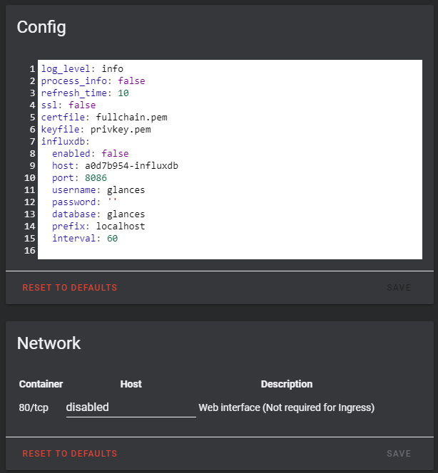
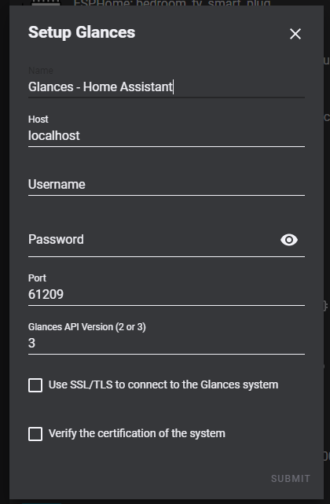

# Home Assistant Core - Configuration for Homekit-Infused and Dwains-Theme

## Contents

 * [Home Assistant Picture Entity Card](#home-assistant-picture-entity-card)
 * [Install Check Home Assistant configuration](#install-check-home-assistant-configuration)
 * [Setting Up Glances addon and Integration](#setting-up-glances-addon-and-integration)
 * [Home Assistant Update Sensor](#update-notifications-core-hacs-supervisor-and-addons)
 * [Update notifications! Core, HACS, Supervisor and Addons](#update-notifications-core-hacs-supervisor-and-addons)
 * [Setting Up The HTML5 Notify Platform](#setting-up-the-html5-notify-platform)
 * [Home Assistant Core Addon Support](#home-assistant-core-addon-suppport)
 * [SNMP](#snmp)


### Theme Requirements 

Details and screenshots of this configuration can be found here:

- [HKI](.././addons/hki/readme_ha_monitor.md)
- [Dwains](.././addons/dwains/readme_ha_monitor.md)

## Home Assistant Picture Entity Card

The Home Assistant [image](.././images/dwains-theme/software/home_assistant_logo.png) is required for the containers card and you will also need the following input text in you configuration

```YAML
input_text:
  card_containers:
    initial: Containers
  software_version:
    initial: Version
```

## Install Check Home Assistant Configuration

Install the `Check Home Assistant configuration` from the Add-on store. You can use this add-on to check whether your configuration files are valid against the new version of Home Assistant before you actually update your Home Assistant installation. This add-on will help you avoid errors due to breaking changes, resulting in a smooth update.

There is an automation created to run before a new update is installed 

```YAML
automation:
  - id: '1585256741683'
    alias: Check config with update
    description: Starts the check config addon when an update becomes available
    trigger:
    - entity_id: binary_sensor.updater
      platform: state
      to: 'on'
    condition: []
    action:
    - data:
        addon: core_check_config
      service: hassio.addon_start
```

## Setting Up Glances Addon and Integration


Install the [Glances](https://github.com/hassio-addons/addon-glances#adding-glances-as-a-sensor-into-home-assistant) Home Assistant Addon from `Supervisor > Add-on Store`

  

Once Glances is configured and running setup the Home Assistant Integration

  

Note: The port of 61209 is important as this is what is used by the addon.


## Home Assistant Update Sensor

To find out when a new version is available for your specific Home Assistant build, create the following sensor.

```YAML
sensor:
  - platform: rest
    resource: https://s3.amazonaws.com/hassio-version/stable.json
    name: Latest Version
    value_template: "{{ value_json.homeassistant.default }}"
    scan_interval: 3600
```
This sensor will check once an hour for new version. Adjust ‘scan_interval’ to change this time frame. The interval is in seconds. (3600 seconds = 60 minutes = 1 hour)

You need to change "{{ value_json.homeassistant.default }}" to match your build type. The json output showing all the options is below.


```JSON
{
  "channel": "stable",
  "supervisor": "138",
  "homeassistant": {
    "default": "0.81.5",
    "qemux86": "0.81.5",
    "qemux86-64": "0.81.5",
    "qemuarm": "0.81.5",
    "qemuarm-64": "0.81.5",
    "intel-nuc": "0.81.5",
    "raspberrypi": "0.81.5",
    "raspberrypi2": "0.81.5",
    "raspberrypi3": "0.81.5",
    "raspberrypi3-64": "0.81.5",
    "tinker": "0.81.5",
    "odroid-c2": "0.81.5",
    "odroid-xu": "0.81.5"
  },
  "hassos": {
    "ova": "1.12",
    "rpi": "1.12",
    "rpi0-w": "1.12",
    "rpi2": "1.12",
    "rpi3": "1.12",
    "rpi3-64": "1.12",
    "tinker": "2.2",
    "odroid-c2": "2.2"
  },
  "hassos-cli": "7"
}
```


## Update notifications! Core, HACS, Supervisor and Addons

Thanks to [CentralCommand](https://community.home-assistant.io/t/update-notifications-core-hacs-supervisor-and-addons/182295) for the excellent write up. If you require any assistance or further configuration please refer back the the post on the Home Assistant Community. I Take zero credit for any of this write up. 

To start we need sensors that tell us when updates are available. For Core and HACS we’re good to go since those come standard with binary_sensor.updater for Core and sensor.hacs for HACS. However there is no sensor for Supervisor and its addons so we need to make one.


```YAML
sensor:
# Sensor to track available updates for supervisor & addons
- platform: command_line
  name: Supervisor updates
  command: 'curl http://supervisor/supervisor/info -H "Authorization: Bearer $(printenv SUPERVISOR_TOKEN)" | jq ''{"newest_version":.data.version_latest,"current_version":.data.version,"addons":[.data.addons[] | select(.version != .installed)]}'''
  value_template: "{{ value_json.addons | length }}"
  json_attributes:
  - newest_version
  - current_version
  - addons
```

Warning - this code requires supervisor version 213
Supervisor is still in early stages and so clearly changes must be expected. If you haven’t updated to 213 yet then you’ll need to change `.data.version_latest` above to `.data.last_version` as it appears the response schema to this API was changed in that release.

```YAML
binary_sensor:

- platform: template
  sensors:
    # True if there's an update available for supervisor
    updater_supervisor:
      friendly_name: 'Updater - Supervisor'
      device_class: problem
      entity_id:
      - sensor.supervisor_updates
      value_template: "{{ state_attr('sensor.supervisor_updates', 'current_version') != state_attr('sensor.supervisor_updates', 'newest_version') }}"
      availability_template: "{{ (states('sensor.supervisor_updates') | int(-1)) > -1 }}"

    # True if there's updates available for any HACS components
    updater_hacs:
      friendly_name: 'Updater - HACS'
      device_class: problem
      entity_id:
      - sensor.hacs
      value_template: "{{ states('sensor.hacs') | int > 0 }}"

    # True if there's updates available for any addons
    updater_addons:
      friendly_name: 'Updater - Addons'
      device_class: problem
      entity_id:
      - sensor.supervisor_updates
      value_template: "{{ states('sensor.supervisor_updates') | int > 0 }}"
```

Just like `binary_sensor.updater` these will set themselves to on when the piece of HA they are tracking needs an update and be off otherwise.

## Setting Up The HTML5 Notify Platform

The html5 notification platform enables you to receive push notifications to Chrome or Firefox, no matter where you are in the world. html5 also supports Chrome and Firefox on Android, which enables native-app-like integrations without actually needing a native app.

```YAML
notify:
  - platform: html5
    name: NOTIFIER_NAME
    vapid_pub_key: YOUR_PUBLIC_KEY
    vapid_prv_key: YOUR_PRIVATE_KEY
    vapid_email: YOUR_EMAIL
```

 * [Requirements](https://www.home-assistant.io/integrations/html5/#requirements)
 
 
 * [Configuration](https://www.home-assistant.io/integrations/html5/#configuring-the-platform)

    * Tip - When you come to domain validation in Google Cloud Platform and you are using your Naba Casa Address use this `URL - https://some-address.ui.nabu.casa/local/`
    * Tip - Place the `google123456789abc.html` in the root of the www folder

 * [Browser Configuration](https://www.home-assistant.io/integrations/html5/#setting-up-your-browser)


Now that we have these we can build alerts to notify me when something needs an update and then remind me periodically if I haven’t updated yet. I have the reminder time set to 6 hours but you can set it however you want. 

```YAML
alert:

# Update is available - un-acknowledgeable, auto-dismiss, me only
# Wait 5 minutes before first to give core config check time to run
  ha_update_available:
    name: HA has an update
    entity_id: binary_sensor.updater
    state: 'on'
    can_acknowledge: false
    repeat: 
    - 5
    - 360
    title: 'Update for HA available'
    message: "New version is {{ state_attr('binary_sensor.updater', 'newest_version') }}. Currently on {{ states('sensor.current_version') }}"
    notifiers:
    - firebase_home_assistant
    - mobile_app_pixel_4_xl
    data:
      tag: 'ha-update-available'
      url: 'http://hassio.local/hassio/addon/core_check_config'
      ttl: 21600

  # Supervisor update is available - un-acknowledgeable, auto-dismiss, me only
  supervisor_update_available:
    name: Supervisor has an update
    entity_id: binary_sensor.updater_supervisor
    state: 'on'
    can_acknowledge: false
    repeat: 360
    title: 'Update for HA Supervisor available'
    message: "New version is {{ state_attr('sensor.supervisor_updates', 'newest_version') }}. Currently on {{ state_attr('sensor.supervisor_updates', 'current_version') }}"
    notifiers:
    - firebase_home_assistant
    - mobile_app_pixel_4_xl
    data:
      tag: 'supervisor-update-available'
      url: 'http://hassio.local/hassio/dashboard'
      ttl: 21600

  # HACS repos have updates available - unknowledgeable, auto-dismiss, me only
  hacs_update_available:
    name: HACS repos have updates
    entity_id: binary_sensor.updater_hacs
    state: 'on'
    can_acknowledge: false
    repeat: 360
    title: "Updates available in {{ states('sensor.hacs') }} HACS repos"
    message: ""
    notifiers:
    - firebase_home_assistant
    - mobile_app_pixel_4_xl
    data:
      tag: 'hacs-update-available'
      url: 'http://hassio.local/hacs/installed'
      ttl: 21600

  # Addons have updates available - unknowledgeable, auto-dismiss, me only
  addon_update_available:
    name: Addons have updates
    entity_id: binary_sensor.updater_addons
    state: 'on'
    can_acknowledge: false
    repeat: 360
    title: "Updates available for {{ states('sensor.supervisor_updates') }} HA addons"
    message: ""
    notifiers:
    - firebase_home_assistant
    - mobile_app_pixel_4_xl
    data:
      tag: 'addon-update-available'
      url: 'http://hassio.local/hassio/dashboard'
      ttl: 21600
```

[Source](https://community.home-assistant.io/t/get-notified-of-available-hassio-addon-updates/176626)

## Home Assistant Core Addon Support

'a0d7b954_adguard' is the add-on name hassio uses. To retrieve the name for your add-on, go to the supervisor panel, and then click on your addon. Once on the add-on page, look at the URL for that page in your browser. The name is at the end of the URL. For example this adguard add-on URL ends in '/hassio/addon/a0d7b954_adguard'

secret llt is a 'long lived token'. To obtain a long lived token, go to your users profile page and scroll all the way to the bottom. Create a token and copy it in to your config. Once you close the window with the LLT you cannot view the token again so be sure to record it. My secret is formatted as follows: 

    llt: "Bearer adfasdfadsfadsfasdfasdfasdfNiJ9.eyJpc3adfasdfasdfTZlZWQ0Nzsuperlongstring of numberslettersetc" 
    
*Be sure to add the Bearer before the token and place the entire thing in quotes.*

The rest sensor pulls the state of the add-on (if its running or not) and then also pulls the `version` which is the current running version of the add-on. It also pulls `last_version` which is the latest available version the add-on can pull. A later version may be available on Github, but the add-on hasn’t synced and doesn’t see the version yet.


```yaml
  - platform: rest
    resource: http://1.2.3.4:8123/api/hassio/addons/a0d7b954_adguard/info
    name: adguard
    value_template: '{{ value_json.data.state }}'
    scan_interval: 60
    headers:
      Authorization: !secret llt
      Content-Type: application/json
    json_attributes_path: "$.data"
    json_attributes:
      - version
      - last_version
```

Further examples can be found in my configuration [here](https://github.com/noodlemctwoodle/homeassistant/blob/4fc9a4634a3bf423a8cec746b7c5d4f542dd697a/packages/ha_core/areas/cabinet/devices/ha_monitor.yaml#L35)

The rest sensor may throw errors on startup if Home Assistant can’t pull the data on startup. I just ignore these as the sensor will continue to try to update and usually does on the second try.

## Switch Template

Create a switch to show/control the add-on state and an automation to turn the other automation on at startup.

```yaml
      glances_addon:
        value_template: "{{ is_state('sensor.glances_addon', 'started') }}"
        turn_on:
          service: hassio.addon_start
          data:
            addon: a0d7b954_glances
        turn_off:
          service: hassio.addon_stop
          data:
            addon: a0d7b954_glances
```

Further examples can be found in my configuration [here](https://github.com/noodlemctwoodle/homeassistant/blob/4fc9a4634a3bf423a8cec746b7c5d4f542dd697a/packages/ha_core/areas/cabinet/devices/ha_monitor.yaml#L246)


## SNMP

More information can be found [here](.././guides/unraid_metrics.md#some-of-the-sensors-discovered-to-far)
